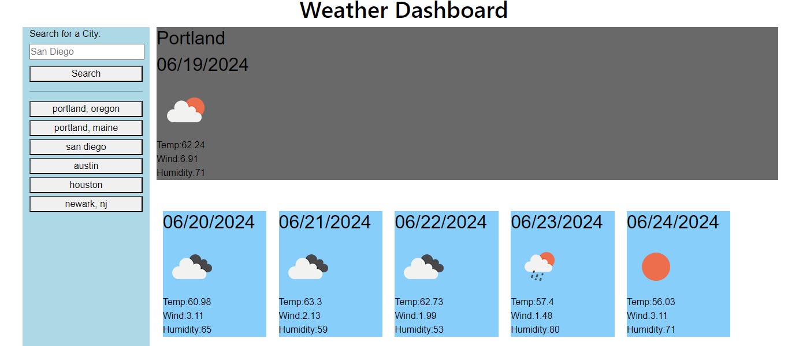

# TITLE: 

Weather Dashboard (Server-Side APIs) for the Full-stack coding bootcamp at Columbia University

## DESCRIPTION:

This weather dashboard allows a user to obain a city's current weather condition along with the five-day forecast. To access the data, third-party APIs were used by making requests with parameters to a URL. 

## ACCEPTANCE CRITERIA:

Create a form input so that when the user searches for a city's weather conditions, that city is added to a search history after presenting the user with the current and future weather conditions.

When viewing current weather conditions for that city, the city name, date, and an icon representations of the weather conditions (e.g. temperature, humidity and wind speed) are presented.

The five-day forecast displays the date, an icon representation of weather conditions, the temperature, the wind speed and the humidity.

When clicking on a city in the search history, then the user is presented with current and future conditions for that city.

## FEATURES:

OpenWeather API was used to retrieve the weather data
Local storage was used to save search histories
Previously searched cities get the current weather and five-day forecast
jQuery event listeners help identify when a user searches for a city (including past cities) or when they clear the search history
Bootsrap grid was used to determine rows and columns for all devices

## Technologies

This API was built with JavaScript, HTML & CSS.

## CREDITS:

While this job was peformed with care by yours truly,

I cannot let the assistance of my classmates, AI, learning assistants, TAs, and professor go unnoticed.

To view this WeatherAPI and other prohects, please visit: 

 https://github.com/katvela24/weatherAPI

## LICENSE:

MIT License

## LINK:

## SCREENSHOT:

 